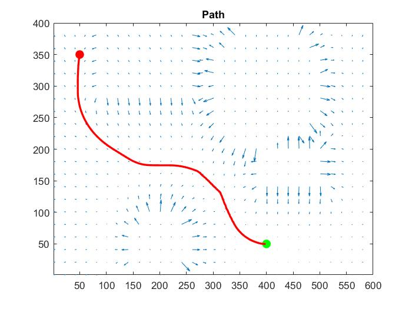

# Artificial Potential Field
The main idea of Artificial Potential Field is constructing a potential field that combines attraction to the goal and repulsion from obstacles, so that the robot can find a path from start(high enery) to goal(low energy) But the main drawback is the robot might be trapped in in local minima and failed to reach the goal.

## Result

