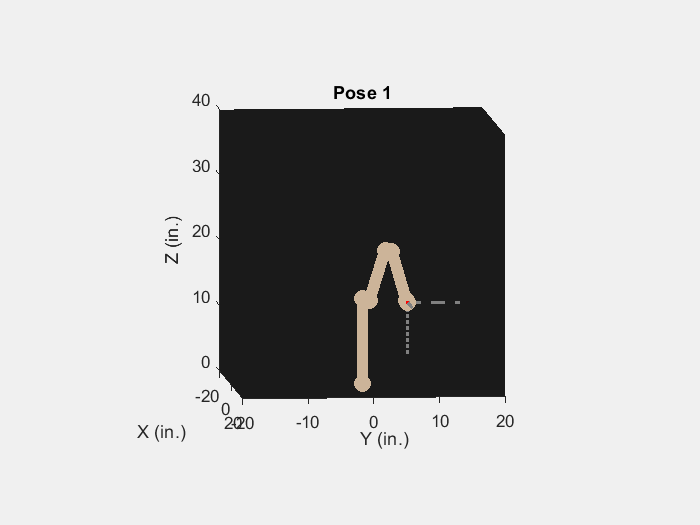

# Light Painting - PUMA Robot Arm Manipulation
Given a set of end-effector states in Cartesian space, compute forward kinematics and analytical solutions to inverse kinematics of the PUMA to light paint a picture of your choice.

## Result

